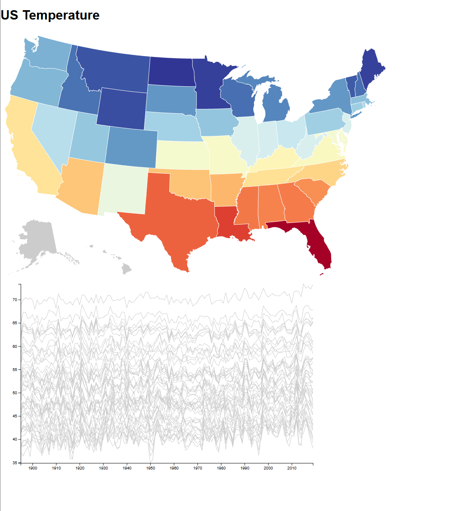
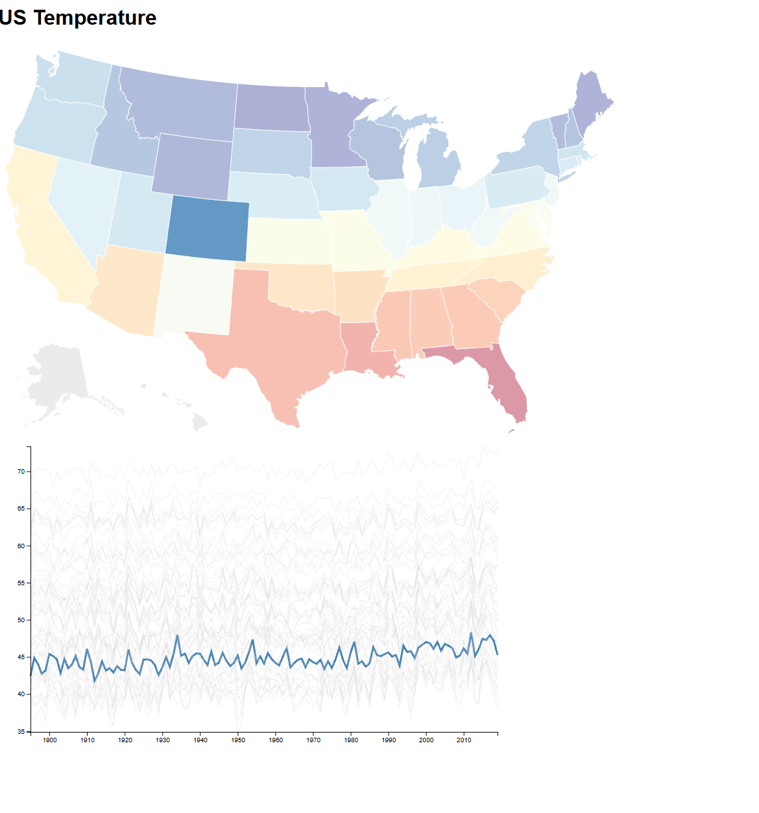

the user will see a map and a line graph with a bunch of gray lines (one for each state), it the user clicks on a state on the map then the line that corresponds to that state will be highlighted and if the user clicks on a line than it will point out the state. 

